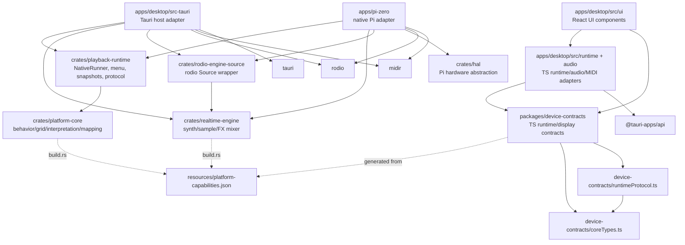
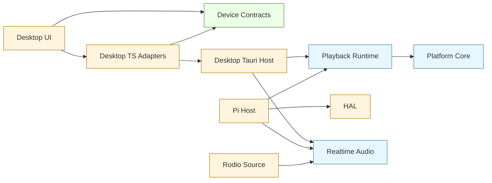

# Architecture And Code Quality Audit

Audit date: 2026-06-15

This audit covers the current native Rust runtime architecture, desktop TypeScript UI/bridge layer, Pi app, realtime audio engine, hardware abstraction, and shared resources. It focuses on dependency shape, architecture compliance, file size, complexity, duplication, unused code/dependencies, and design smells.

Update status: the first hygiene pass after this audit fixed the TypeScript contract cycle, removed unused Rust dependencies, removed the unused vendored `signalsmith-stretch` tree, privatized unused TypeScript exports, split OLED/grid/controls rendering and runtime/audio/keyboard hooks out of `App.tsx`, and moved native menu option tables into `native_menu/options.rs`.

## Tooling Used

- `cargo metadata --format-version 1 --no-deps`
- `cargo tree --workspace --depth 2`
- `cargo machete`
- `tokei`
- `corepack pnpm run quality:audit`
- `corepack pnpm dlx madge --circular --extensions ts,tsx apps/desktop/src packages/device-contracts/src`
- `corepack pnpm dlx knip --no-exit-code`
- `corepack pnpm dlx jscpd --reporters console --min-lines 25 --min-tokens 80 --ignore "**/target/**,**/node_modules/**,**/dist/**,**/signalsmith-stretch/**" .`
- `cargo modules dependencies`
- Targeted `rg` boundary scans

The audit was read-only. No source files were changed during tool execution.

## Executive Summary

- No serious Rust crate-level dependency loops were found.
- The primary architecture direction is healthy: desktop/Pi adapters depend downward on runtime/audio/HAL; `playback-runtime` depends on `platform-core`; audio output depends on `realtime-engine` through `rodio-engine-source`.
- Canonical Rust core/runtime crates do not depend on Tauri, HAL, filesystem storage, MIDI devices, or audio device APIs.
- The largest risk is maintainability: `NativeRunner`, `native_menu`, `App.tsx`, and realtime synth/FX modules are oversized and carry multiple responsibilities.
- The TypeScript import cycle originally found in `packages/device-contracts` has been fixed by moving shared core contract types into `coreTypes.ts`.
- The unused dependency/export findings from the first tool run have been cleaned up.
- Duplication is mostly fixture/default-preset data and tests; production duplication is comparatively low.

## Internal Dependency Diagram



## Intended Layering



## Architecture Compliance

Good:

- `platform-core` stays free of Tauri, HAL, filesystem/storage, MIDI-device, and audio-device dependencies.
- `playback-runtime` stays free of Tauri, HAL, concrete storage implementation, and hardware adapter dependencies.
- Desktop and Pi apps act as host adapters around native runtime/core behavior.
- Internal synth/sample audio routes through `realtime-engine` and `rodio-engine-source`.
- `resources/platform-capabilities.json` is the source for platform dimensions and limits.
- The TypeScript workspace is small and limited to desktop UI plus shared contracts.

Concerns:

- `platform-core`, `realtime-engine`, and TypeScript each parse or generate from the same capabilities JSON with separate validation/generation code. The source is single, but generator behavior is duplicated.
- The native runtime/menu design is heavily centralized in two files, which makes boundary-compliant changes harder than necessary.

## Dependency Findings

### Rust Workspace

Observed high-level Rust dependencies:

- `playback-runtime -> platform-core`
- `rodio-engine-source -> realtime-engine`
- `cellsymphony-desktop -> playback-runtime, realtime-engine, rodio-engine-source, rodio, midir, tauri`
- `cellsymphony-pi -> playback-runtime, realtime-engine, rodio-engine-source, cellsymphony-hal, rodio, midir`
- `cellsymphony-hal` has optional `pi-zero` hardware dependencies.

No Rust crate cycle was found.

`cargo machete` post-cleanup result:

- No unused Rust dependencies found.

Completed cleanup:

- Removed unused `nix` from `crates/hal`.
- Removed unused `signalsmith-stretch` from `crates/realtime-engine`.
- Removed the root `[patch.crates-io]` override for `signalsmith-stretch`.
- Removed the unreferenced vendored `crates/signalsmith-stretch` tree.

### TypeScript Workspace

Observed TypeScript dependencies:

- `apps/desktop/src/ui` imports `@cellsymphony/device-contracts` and desktop-local adapters.
- `apps/desktop/src/runtime` and `apps/desktop/src/audio` own direct Tauri API calls.
- `packages/device-contracts` has no runtime dependencies.

`madge` post-cleanup result:

- No TypeScript import cycles found.

Completed cleanup:

- Moved shared runtime/display core types into `packages/device-contracts/src/coreTypes.ts`.
- Made `runtimeProtocol.ts` import from `coreTypes.ts` instead of `index.ts`.

## Size And Complexity Findings

`quality:audit` summary:

- Files scanned: 101
- Named functions scanned: 1044
- Large files over 500 LOC: 10
- Complex functions over threshold 10: 24
- Long functions over 60 LOC: 53
- Wide signatures over 4 params: 10

Tracked source files over 500 LOC:

| File | LOC |
|---|---:|
| `crates/playback-runtime/src/native_runner.rs` | 7810 |
| `crates/playback-runtime/src/native_runner/tests.rs` | 4242 |
| `crates/playback-runtime/src/native_menu.rs` | 3963 |
| `crates/realtime-engine/src/synth/tests.rs` | 1478 |
| `crates/realtime-engine/src/synth/engine.rs` | 1178 |
| `crates/realtime-engine/src/synth/fx.rs` | 905 |
| `crates/playback-runtime/src/native_menu/tests.rs` | 796 |
| `crates/platform-core/src/interpretation.rs` | 517 |
| `apps/desktop/src-tauri/src/host_adapter.rs` | 512 |
| `crates/realtime-engine/src/synth/types.rs` | 534 |

Top complexity hotspots:

| Function | Complexity | LOC |
|---|---:|---:|
| `NativeRunner::apply_config_payload` | 132 | 529 |
| `NativeRunner::apply_instrument_menu_state` | 67 | 400 |
| `NativeRunner::handle_device_input` | 67 | 231 |
| `NativeRunner::apply_menu_state` | 44 | 189 |
| `OledTextFallback` | 33 | 97 |
| `App` | 16 | 121 |
| `scanFunctions` | 24 | 1 |
| `SynthEngine::next_stereo_sample` | 22 | 157 |
| `apps/pi-zero::main` | 17 | 139 |
| `NativeMenuModel::snapshot` | 15 | 113 |
| `apply_sense_payload` | 15 | 114 |

## Duplication Findings

`jscpd` found 24 clones, but most are low-risk:

- Default preset JSON repeats expected per-part/per-instrument data.
- Audio/realtime tests repeat setup patterns.
- Core/runtime boundary tests intentionally duplicate a similar boundary guard.

Production duplication worth reviewing:

- `crates/playback-runtime/src/native_runner.rs` has duplicated snapshot/config payload shaping around two separate sections.
- Desktop/Pi host adapters independently implement store/preset/sample/MIDI effect handling. They differ enough to avoid premature abstraction before Pi hardware validation, but shared path sanitization helpers may be useful later.
- Capability JSON validation/generation logic is duplicated across Rust build scripts and TypeScript generation.

## Unused Code And Dependency Findings

`knip` post-cleanup result:

- No unused TypeScript exports reported.

Completed cleanup:

- Made `audioConfigSignature` private.
- Made `TauriCoreRunnerClient` private.
- Made `RuntimeMessagesBatch` private.
- Inlined `NeoKeyLeds` into `SimulatorSnapshot`.

Suppression scan:

- No `#[allow(dead_code)]`, `#[allow(unused)]`, `@ts-ignore`, `@ts-expect-error`, or eslint-disable suppressions were found in active Rust/TS source.

## SOLID And Design Smells

### `NativeRunner` God Object

`crates/playback-runtime/src/native_runner.rs` owns:

- runtime transport state
- active behavior/part engine state
- menu state synchronization
- config payload creation and restore/migration
- instrument menu edits
- Sense/mapping menu edits
- Dance mode state and overlays
- sample assignment and browser state
- trigger probability maps
- param modulation
- MIDI status and port selections
- store result handling
- snapshot generation
- OLED/LED overlay generation
- confirmation dialogs and toasts

This violates single responsibility and makes changes high-friction. The tests are strong, but the monolith increases shotgun-surgery risk.

### Native Menu Monolith

`crates/playback-runtime/src/native_menu.rs` combines:

- menu navigation
- menu tree construction
- display formatting
- help target resolution helpers
- action key mapping
- parameter tree construction
- instrument/FX/system/Dance group definitions

This creates a long file and makes menu changes harder to localize.

### Stringly Typed Menu And Action IDs

Menu/action behavior depends on string IDs such as action keys, menu keys, target keys, FX kind strings, and path-derived help targets. This is pragmatic but weakens compile-time safety. Adding or renaming actions often requires coordinated edits across menu construction, runner dispatch, help TSV, confirmation logic, and tests.

### Desktop UI Concentration

`apps/desktop/src/ui/App.tsx` still owns too many concerns:

- runtime bootstrapping
- keyboard dispatch
- audio config scheduling
- grid rendering
- OLED rendering
- controls panel rendering
- brightness behavior
- runtime status display

Split along UI/runtime/audio boundaries when working in this file.

### Realtime Engine Concentration

`crates/realtime-engine/src/synth/engine.rs` and `fx.rs` are still large and performance-sensitive. The architecture is valid, but long functions increase risk of subtle audio regressions.

## Boundary And Runtime Safety Findings

Positive:

- `platform-core` boundary scans only found the word `hardware` in a test name for platform capabilities; no host adapter dependency leakage.
- `playback-runtime` scans found no real Tauri/HAL/filesystem/storage implementation leakage.
- Tauri and Pi filesystem/MIDI/audio-device code is contained in host apps.
- Pi HAL access is isolated in `crates/hal` and `apps/pi-zero`.

Concerns:

- Pi `main()` uses fail-fast `expect()` for I2C/OLED/Trellis/NeoKey/DAC init. This may be acceptable for the first hardware build, but once hardware bring-up starts it should become explicit user-visible startup status rather than process panic.
- `crates/hal/src/i2s_dac.rs` still has a placeholder `trigger_note()` API even though real audio is through rodio/realtime-engine. This is stale API surface.

## Recommended Cleanup Plan

### Completed Hygiene Pass

1. Broke the `device-contracts` import cycle.
2. Made unused TS exports private or inlined.
3. Removed unused `nix` from `crates/hal`.
4. Removed unused `signalsmith-stretch` dependency, root patch, and vendored source tree.
5. Updated `tools/quality-audit.mjs` to ignore vendored `signalsmith-stretch` directories if they reappear.
6. Split OLED/grid/controls rendering and runtime/audio/keyboard hooks out of `apps/desktop/src/ui/App.tsx`.
7. Moved native FX option tables and duck-source option construction into `crates/playback-runtime/src/native_menu/options.rs`.

### Do Next

1. Split `NativeRunner` by responsibility:
   - `config_payload.rs`
   - `config_apply.rs`
   - `instrument_state.rs`
   - `dance.rs`
   - `sample_assignment.rs`
   - `overlays.rs`
   - `store_results.rs`
   - keep `native_runner.rs` as orchestration shell
2. Split `native_menu.rs`:
   - `model.rs` / navigation
   - `build.rs` / root tree construction
   - `format.rs` / display formatting
   - `help_keys.rs`
   - group builders such as `groups/voice.rs`, `groups/system.rs`, `groups/dance.rs`, `groups/l2.rs`
3. Split realtime FX processors into smaller modules or processor groups while keeping audio callback allocation-free.

### Do Later

1. Centralize capability generator validation/parsing so Rust and TS generation share one validation implementation or checked generated outputs.
2. Replace high-value stringly typed action/menu IDs with typed constants/enums.
3. Add CI checks for:
    - `madge --circular`
    - `cargo machete`
    - `knip`
    - vendor-aware `quality:audit`
4. Revisit Pi hardware startup errors after the first successful physical run.

### Leave Alone For Now

- Default JSON data duplication.
- Test fixture duplication unless adjacent tests are being edited.
- Desktop/Pi host adapter duplication until Pi hardware behavior is validated.
- Pi hardware startup `expect()` calls until the first hardware run establishes the desired operator-facing failure mode.

## Suggested Follow-Up Sequence

1. Commit and verify the completed hygiene pass.
2. Split `native_menu.rs` first; it is large but lower-risk than runner state mutation.
3. Split `NativeRunner` config apply/payload code next, preserving existing tests.
4. Split realtime FX internals only after audio regression tests are stable and fast enough to run frequently.

## Appendix: Commands

```bash
cargo metadata --format-version 1 --no-deps
cargo tree --workspace --depth 2
cargo machete
tokei . --exclude target --exclude node_modules --exclude dist --exclude .git
corepack pnpm run quality:audit
corepack pnpm dlx madge --circular --extensions ts,tsx apps/desktop/src packages/device-contracts/src
corepack pnpm dlx knip --no-exit-code
corepack pnpm dlx jscpd --reporters console --min-lines 25 --min-tokens 80 --ignore "**/target/**,**/node_modules/**,**/dist/**,**/signalsmith-stretch/**" .
```
